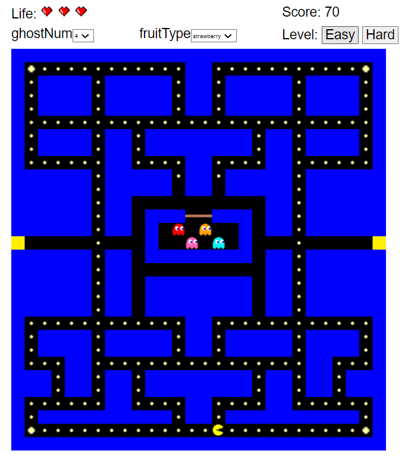
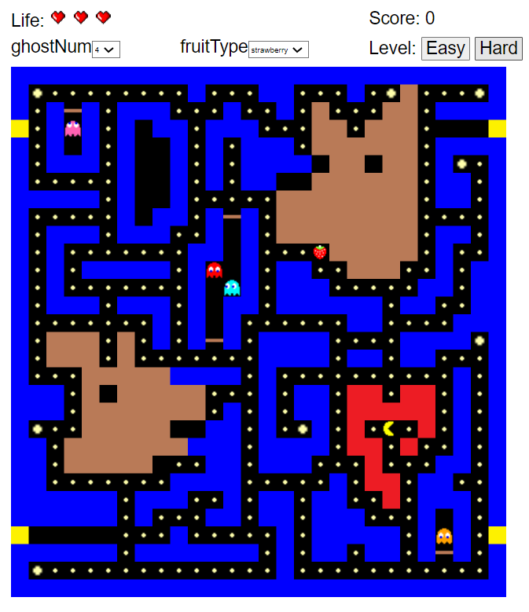

# Game Development - Pacman

Link: https://pacman-final-team-dog.herokuapp.com/
<!-- TABLE OF CONTENTS -->
<h2 id="table-of-contents">Contents</h2>
  <ol>
    <li><a href="#desc"> ➤ Description</a></li>
    <li><a href="#contributors"> ➤ Contributors</a></li>
  </ol>
 

<h2 id="desc"> 1. Description</h2>
 

Please use W, A, S, D or Arrow keys to move the pacman.

 

| Easy | Hard |
|:----------:|:----------:|
|  |  |

 

<h2 id="contributors"> 2. Contributors</h2>
 

Team Lead: Lize Chen

Tech Lead: Huaminghui Ding

Documentation Lead: Tingting Li

Developer: Daolun Chen

Developer: Ruimin Li

Developer: Yichen Sun

Developer: Junhao Yu

